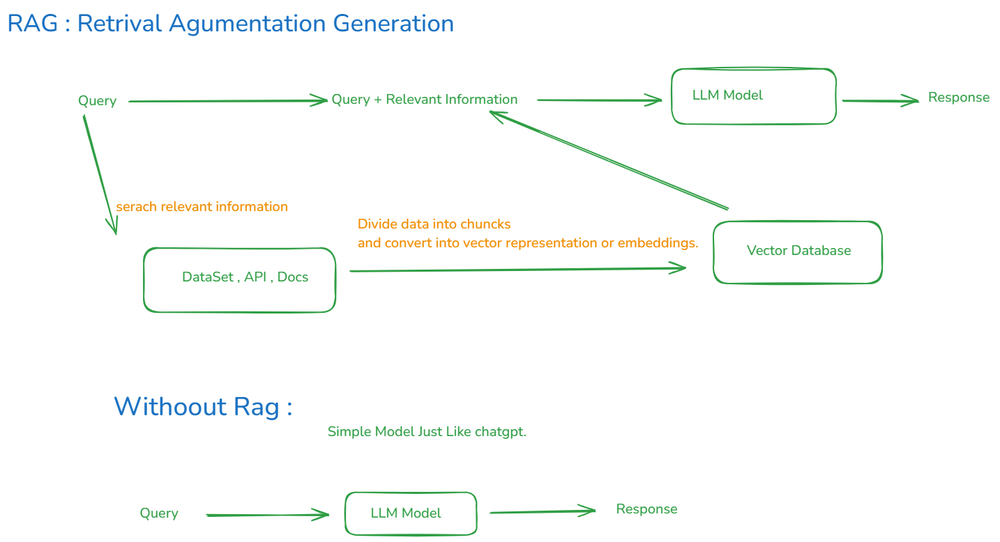

# Retrieval Augmented Generation (RAG)

## Introduction

Retrieval Augmented Generation (RAG) enhances Large Language Models (LLMs) by integrating external, relevant data into responses. This approach improves the accuracy and context of AI-generated responses by combining retrieval systems with generative AI.

---

## RAG Workflow

1. **Input Query**:  
   The user inputs a query.

2. **Retrieve Relevant Data**:  
   The system searches external data sources like datasets, APIs, or documents for relevant information.

3. **Data Processing**:

   - Divide data into smaller chunks.
   - Convert the chunks into vector embeddings for similarity matching.

4. **Vector Database**:  
   Store the embeddings in a vector database for efficient retrieval.

5. **Query Enhancement**:  
   Combine the original query with retrieved context to form an enhanced query.

6. **Generate Response**:  
   Pass the enhanced query to the LLM, which generates a detailed response.

---

## Without RAG Workflow

1. **Input Query**:  
   The query is directly sent to the LLM.

2. **Generate Response**:  
   The LLM responds based only on pre-trained knowledge.

---

## Key Components

- **Datasets/APIs/Documents**: External data sources to provide additional context.
- **Vector Embeddings**: Numerical representations of text, enabling similarity searches.
- **Vector Database**: Storage for embeddings to allow fast and accurate retrieval.
- **LLM Model**: A language model responsible for generating responses.

---

## Advantages of RAG

- Provides more accurate, context-aware responses.
- Integrates real-time or domain-specific data.
- Scalable with new data sources or domains.

---

## Implementation Guide

1. **Prepare Data**:  
   Gather external data (datasets, APIs, or documents) relevant to your domain.

2. **Chunk Data**:  
   Divide the data into smaller chunks for better processing.

3. **Create Vector Embeddings**:  
   Convert the chunks into vector representations using an embedding model.

4. **Store in Vector Database**:  
   Save the embeddings in a vector database like Pinecone, Weaviate, or FAISS.

5. **Build Retrieval System**:  
   Use the vector database to fetch the most relevant data for any query.

6. **Combine with Query**:  
   Append retrieved data to the user query.

7. **Pass to LLM**:  
   Send the enhanced query to the LLM for response generation.

---

This ReadMe provides a step-by-step understanding of the RAG methodology and how it can improve your AI system.
